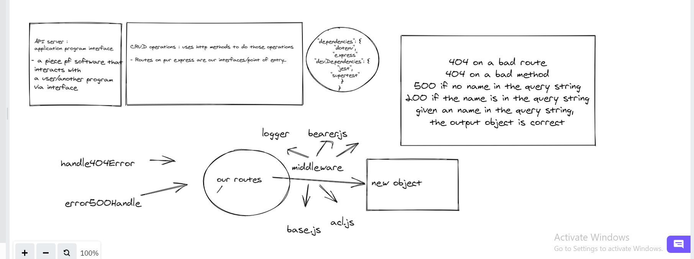
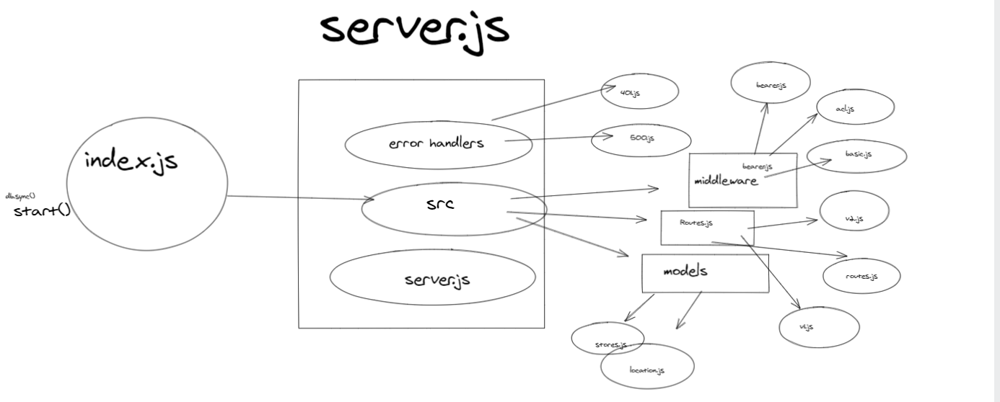
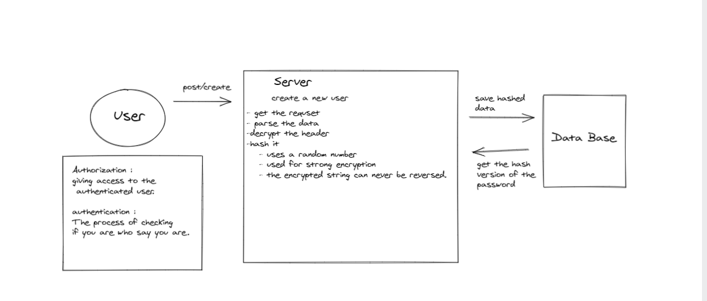

# Auth-Module-Final-Project

## Authors:
///////////////////////
 * Dima Alabsi
* Hasnaa Habahbeh
* Mohammad aljedayh
* Aseel Alasaad

## Setup
 .env requirements
* PORT = 8080
## Running the app

* npm run dev
* Nodemon index.js

* Endpoint:  **/status** 

    * Returns Object

{

  ***"status": "running",***

  ***"port": 3001***

}

## Tests

* Unit Tests: **npm run test**

## Run

***nodemon index.js***

## Heroku applications 

*   [main branch]() 
*    

## Github actions

*    [actions]()      

## pull request

* [last pull request]()

# dependencies 💯

* base-64
* bcrypt
* cors
* dotenv
* express
* pg
* sequelize
* sequelize-cli
* sqlite3
* jest
* supertest
* jsonwebtoken
 * morgan
* eslint
* method-override

## UML

